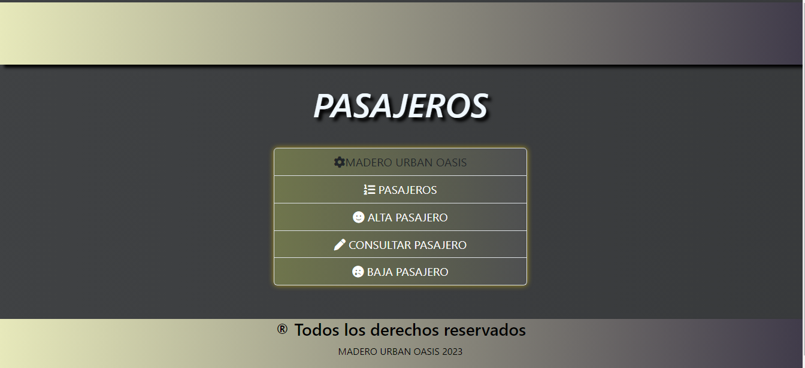
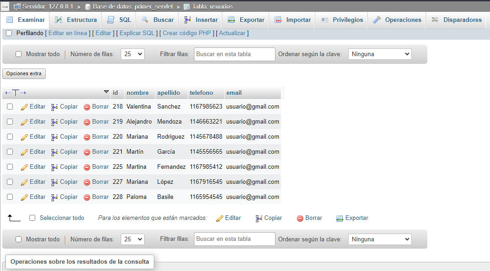

# TPIntegrador-CodoaCodo

## Contenido
1. información general
2. tecnologías
3. colaboradores

### Información general
Proyecto integrador final del curso de fullstack Java  de Coco a Codo. Se trata de una pequeña página con un sistema de gestión para un hotel en donde se pueden ingresar, ver , listar y eliminar a los pasajeros del mismo. 
### Algunas imágenes
<kbd>

</kbd>

<kbd>

</kbd>

## Tecnologías
Proyecto desarrollado con:
* [JAVA] 
* [HTML]
* [CSS]
* [JAVASCRIPT]

## Colaboración 
Integrantes del grupo 8 que colaboraron con el desarrollo del proyecto.
<ul>
 <li>Gastón Massa</li>
 <li>Julián Piedrabuena</li>
 <li>Edwin Salcedo</li>
 <li>Matías Santos</li>
 <li>Alan Marcello</li>
 <li></li>
</ul>

